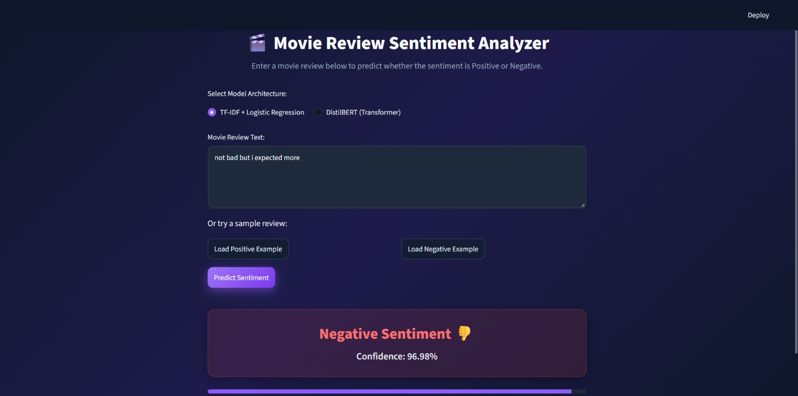

# 🎬 Movie Review Sentiment Analyzer

Classifies IMDB movie reviews as **Positive** or **Negative**, and compares a classical approach (TF-IDF + Logistic Regression) with a fine-tuned transformer (DistilBERT). Includes a Streamlit web app for live predictions.

**Live demo (TF-IDF model):** https://movie-sentiment-sowmiya.streamlit.app



## Dataset

[IMDB Dataset of 50K Movie Reviews](https://www.kaggle.com/datasets/lakshmi25npathi/imdb-dataset-of-50k-movie-reviews) from Kaggle: 50,000 reviews labelled `positive` or `negative`. The file is not included in this repository because of its size. Download it and place `IMDB Dataset.csv` in the project folder to retrain.

## Approach

**Preprocessing:** lowercase the text and remove HTML tags such as `<br />`.
**Split:** 80/20 train/test split with `random_state=42` (40,000 train / 10,000 test), shared by both models.

1. **TF-IDF + Logistic Regression** (`train_tfidf.py`): TF-IDF features (25,000 max features) fed into a Logistic Regression classifier, trained on all 40,000 training reviews.
2. **DistilBERT** (`train_transformer.py`): `distilbert-base-uncased` fine-tuned with Hugging Face `Trainer`. Because training ran on a laptop CPU, it used a subset: 4,000 training reviews, max length 256, 1 epoch, batch size 16.

## Results

Both models were evaluated on the same 1,000 held-out test reviews (`compare.py`):

| Model | Accuracy | Precision | Recall | F1-Score |
|---|---|---|---|---|
| TF-IDF + Logistic Regression | 0.9070 | 0.8916 | 0.9160 | 0.9036 |
| DistilBERT (fine-tuned) | 0.8760 | 0.8877 | 0.8466 | 0.8667 |

On the full 10,000-review test set, TF-IDF + Logistic Regression reached an accuracy of 0.9003.

### Analysis

TF-IDF + Logistic Regression outperformed the fine-tuned DistilBERT on this test set (accuracy 0.9070 vs 0.8760, F1 0.9036 vs 0.8667). Precision is nearly the same for both; the gap comes mainly from recall, where DistilBERT missed more of the positive reviews (0.8466 vs 0.9160).

This comparison is not like-for-like. DistilBERT was fine-tuned for one epoch on 4,000 reviews because of CPU limits, while TF-IDF was trained on 40,000. With more training data, more epochs and GPU training, the transformer would be expected to improve, but I have not tested this.

TF-IDF also has a known limitation: it counts words and does not model context. For mixed reviews such as "Not bad, but I expected more", its prediction can be overconfident.

## Run locally

```bash
python -m venv venv
venv\Scripts\activate          # Windows
pip install -r requirements-train.txt
```

Then, with `IMDB Dataset.csv` in the folder:

```bash
python train_tfidf.py          # trains and saves tfidf_model.joblib
python train_transformer.py    # fine-tunes DistilBERT (slow on CPU, ~40 min)
python compare.py              # prints the comparison table
streamlit run app.py           # launches the app with both models
```

## Deployment

The hosted demo uses only the TF-IDF model: the fine-tuned DistilBERT model is about 268 MB, which exceeds GitHub's file limit and free hosting memory. The app detects whether the `transformer_model/` folder exists and shows only the TF-IDF option when it is missing. For the deployed app, `requirements.txt` contains the lightweight dependencies only.

## Project structure

```
├── app.py                  # Streamlit app
├── train_tfidf.py          # TF-IDF + Logistic Regression training
├── train_transformer.py    # DistilBERT fine-tuning
├── compare.py              # side-by-side evaluation
├── tfidf_model.joblib      # trained TF-IDF model
├── requirements.txt        # lightweight, for deployment
├── requirements-train.txt  # full dependencies, for training
└── .streamlit/config.toml  # app theme
```

## Tech stack

Python, scikit-learn, pandas, Hugging Face Transformers, PyTorch, Streamlit

## Author

Sowmiya